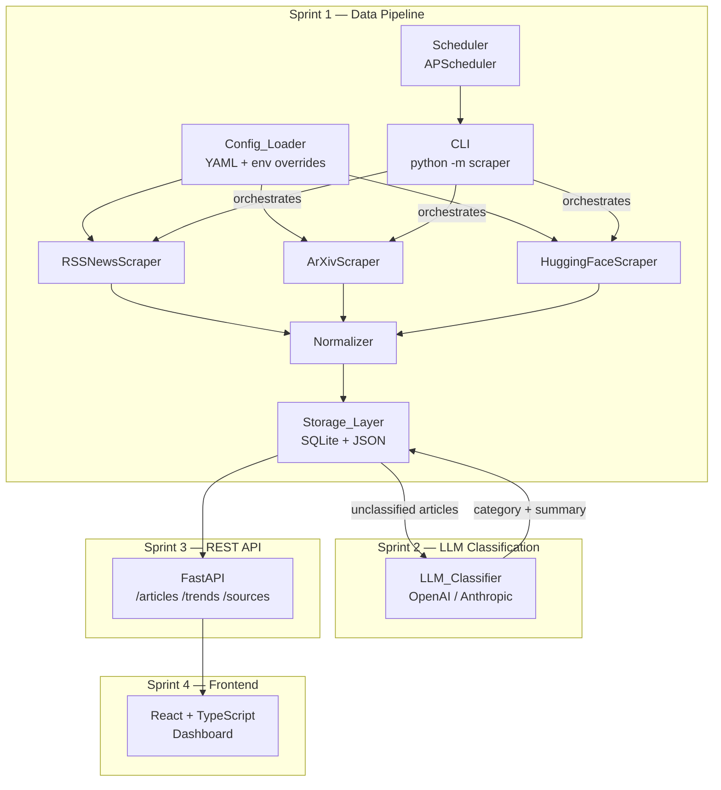
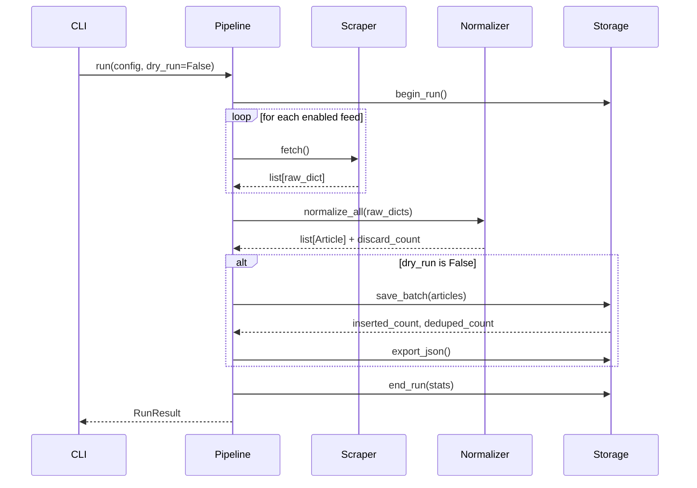

# Design Document: AI Intelligence Dashboard

## Overview

The AI Intelligence Dashboard is a full-stack application that ingests AI-related content from
multiple public sources, enriches it via LLM classification, and surfaces it through a REST API
consumed by a React + TypeScript frontend. Delivery is structured across five sprints; each sprint
builds on a stable, extension-ready foundation rather than requiring rewrites of prior work.

This document covers the complete technical design, with Sprint 1 (backend data pipeline) as the
primary focus and Sprints 2–5 captured as explicit extensibility contracts.

### Design Philosophy

- **Ports and Adapters at the scraper boundary**: each source is a self-contained adapter behind a
  common `Scraper` interface. Adding a new source never touches orchestration code.
- **Immutable canonical schema early**: the `Article` dataclass is defined in Sprint 1 and never
  broken; Sprint 2 adds optional fields rather than changing existing ones.
- **SQLite is the right default**: single-file, zero-config, sufficient for tens of millions of
  rows with proper indexing. A migration to PostgreSQL is possible later via SQLAlchemy's dialect
  abstraction without changing query code.
- **Config over code**: every tunable—feed URLs, intervals, timeouts, API keys—lives in YAML or
  environment variables. No source-code changes are needed to add a feed.

---

## Architecture



The pipeline is intentionally linear. Each component communicates through typed interfaces, not
direct module coupling, so any stage can be replaced or extended independently.

---

## Components and Interfaces

### Project Directory Structure

```
ai-intel-dashboard/
├── backend/
│   ├── scraper/
│   │   ├── __init__.py
│   │   ├── __main__.py          # entry point: python -m scraper
│   │   ├── base.py              # AbstractScraper ABC
│   │   ├── rss.py               # RSSNewsScraper
│   │   ├── arxiv.py             # ArXivScraper
│   │   └── huggingface.py       # HuggingFaceScraper
│   ├── normalizer/
│   │   ├── __init__.py
│   │   └── normalizer.py        # Normalizer + ArticleBuilder
│   ├── storage/
│   │   ├── __init__.py
│   │   ├── models.py            # SQLAlchemy ORM models
│   │   ├── storage_layer.py     # Storage_Layer
│   │   └── migrations/          # future Alembic scripts
│   ├── pipeline/
│   │   ├── __init__.py
│   │   ├── pipeline.py          # Pipeline orchestrator
│   │   └── scheduler.py         # APScheduler wrapper
│   ├── config/
│   │   ├── __init__.py
│   │   └── config_loader.py     # Config_Loader
│   ├── classifier/              # Sprint 2 — stub only in Sprint 1
│   │   ├── __init__.py
│   │   └── base.py              # AbstractClassifier ABC
│   ├── api/                     # Sprint 3
│   │   ├── __init__.py
│   │   ├── main.py              # FastAPI app
│   │   └── routers/
│   ├── models/
│   │   └── article.py           # Article dataclass (canonical schema)
│   └── logging_config.py        # structured / human logging setup
├── frontend/                    # Sprint 4
│   ├── src/
│   │   ├── components/
│   │   ├── hooks/
│   │   └── pages/
│   ├── package.json
│   └── tsconfig.json
├── config/
│   └── feeds.yaml               # default feed configuration
├── data/                        # runtime artefacts (git-ignored)
│   ├── articles.db
│   └── articles.json
├── tests/
│   ├── unit/
│   ├── integration/
│   └── property/                # PBT tests (pytest-hypothesis)
├── pyproject.toml               # pinned deps, build config
├── README.md
└── .env.example
```

### Module Responsibilities

#### `AbstractScraper` (backend/scraper/base.py)

The common interface every source adapter must satisfy:

```python
from abc import ABC, abstractmethod
from typing import Any

class AbstractScraper(ABC):
    @abstractmethod
    def fetch(self) -> list[dict[str, Any]]:
        """Return raw source records. Never raises; logs and returns [] on failure."""
        ...

    @property
    @abstractmethod
    def source_name(self) -> str:
        ...
```

Adding a Sprint-N source means writing a new class that implements this interface and registering
it in `feeds.yaml`. Zero changes to `Pipeline`.

#### `RSSNewsScraper` (backend/scraper/rss.py)

- Uses `feedparser` for RSS/Atom parsing (pure-Python, no external HTTP dependency for the parse
  step; feedparser handles redirects internally via `urllib`).
- Raises no exceptions to callers; catches all fetch/parse errors, logs them, and returns `[]`.
- Deduplication by URL happens here before returning records.

**Tradeoff — feedparser vs httpx + BeautifulSoup**:
`feedparser` handles RSS, Atom, and quirky feeds out of the box with a single dependency. `httpx`
would give more control over timeouts and retries but requires manual HTML/XML parsing. For RSS
feeds, `feedparser` is the right tool; `httpx` is reserved for the arXiv and Hugging Face scrapers
that hit JSON/XML APIs directly.

#### `ArXivScraper` (backend/scraper/arxiv.py)

- Uses `httpx` with synchronous client (async deferred to Sprint 3 if needed).
- Queries the arXiv API (`http://export.arxiv.org/api/query`) with `feedparser` for Atom response
  parsing.
- Implements exponential backoff (max 3 retries) via `tenacity`.
- Deduplication by arXiv paper ID before returning.

#### `HuggingFaceScraper` (backend/scraper/huggingface.py)

- Fetches from the Hugging Face public REST API (`https://huggingface.co/api/`).
- Uses `httpx` with configurable timeout.
- Falls back to fetch timestamp as `published_at` when the API returns no native date.
- Deduplication by URL.

#### `Normalizer` (backend/normalizer/normalizer.py)

- Stateless: takes a raw `dict` and returns an `Article | None`.
- Required fields: `title`, `url`, `published_at`. Missing any → log warning, return `None`.
- Timestamp normalization via `python-dateutil` → always output UTC ISO 8601
  (`YYYY-MM-DDTHH:MM:SSZ`).
- `summary` truncation at 2000 chars, respecting UTF-8 boundaries (slice on encoded bytes, decode
  with `errors='ignore'`).
- `id` generated as `uuid.uuid4()`.

#### `Storage_Layer` (backend/storage/storage_layer.py)

- Wraps SQLAlchemy Core (not ORM) for explicit, readable SQL with SQLite dialect.
- All writes are transactional; rollback on any exception.
- Upsert on `url` uniqueness: updates `fetched_at` and `raw` only.
- JSON snapshot written atomically (write to `articles.json.tmp`, then `os.replace`).
- Exposes a clean query interface that Sprint 3's FastAPI routers will call directly.

#### `Config_Loader` (backend/config/config_loader.py)

- Loads `feeds.yaml`, merges `AIID_*` environment variable overrides, validates with `pydantic`
  `BaseSettings`, raises `ConfigurationError` on missing required fields.
- Returns a single typed `AppConfig` object consumed by all other modules.

#### `Pipeline` (backend/pipeline/pipeline.py)

- Orchestrates: `[scraper.fetch() for scraper in scrapers]` → `normalizer.normalize_all()` →
  `storage.save_batch()`.
- Records a `Run` entry in the `runs` table (start, end, counts, status).
- Respects `--dry-run` flag by skipping the `storage.save_batch()` call.
- Timeout enforced via `concurrent.futures` with `threading.Timer` (stdlib, no extra dep).

#### `Scheduler` (backend/pipeline/scheduler.py)

- Wraps `APScheduler` `BlockingScheduler` with an `IntervalTrigger`.
- On timeout: calls `job.remove()`, logs the timeout, re-schedules at normal interval.

**Tradeoff — APScheduler vs system cron**:
APScheduler runs in-process, ships as a Python package, and requires no OS-level configuration.
System cron is simpler but requires the host environment to be configured separately and makes
timeout logic harder. APScheduler is the right default; operators can always wrap the CLI command
in cron if they prefer.

#### `AbstractClassifier` (backend/classifier/base.py) — Sprint 2 stub

```python
from abc import ABC, abstractmethod
from backend.models.article import Article

class AbstractClassifier(ABC):
    @abstractmethod
    def classify(self, article: Article) -> tuple[str, str]:
        """Returns (category, summary). Raises ClassificationError after retries."""
        ...
```

Sprint 1 ships this stub. Sprint 2 drops in `OpenAIClassifier` and `AnthropicClassifier` without
touching any Sprint 1 code.

---

## Data Models

### Canonical `Article` Schema

```python
from dataclasses import dataclass, field
from typing import Any

@dataclass
class Article:
    id: str                        # UUID v4 string
    title: str
    url: str
    source: str
    published_at: str | None       # UTC ISO 8601 "YYYY-MM-DDTHH:MM:SSZ", null if unparseable
    fetched_at: str                # UTC ISO 8601, set at normalization time
    summary: str | None            # max 2000 chars
    authors: list[str]             # empty list when not available
    tags: list[str]                # empty in Sprint 1; populated by Sprint 2+
    category: str | None           # null until LLM classification (Sprint 2)
    raw: dict[str, Any]            # original source payload, preserved verbatim
```

Sprint 2 adds `classification_failed: bool = False` as an optional field with a default — no
migration needed for existing rows because SQLite ADD COLUMN supports DEFAULT.

### SQLite Schema

```sql
CREATE TABLE IF NOT EXISTS articles (
    id           TEXT PRIMARY KEY,          -- UUID v4
    title        TEXT NOT NULL,
    url          TEXT NOT NULL UNIQUE,
    source       TEXT NOT NULL,
    published_at TEXT,                      -- ISO 8601 UTC, nullable
    fetched_at   TEXT NOT NULL,
    summary      TEXT,
    authors      TEXT NOT NULL DEFAULT '[]', -- JSON array
    tags         TEXT NOT NULL DEFAULT '[]', -- JSON array
    category     TEXT,
    raw          TEXT NOT NULL              -- JSON object
);

CREATE INDEX IF NOT EXISTS idx_articles_published_at ON articles (published_at DESC);
CREATE INDEX IF NOT EXISTS idx_articles_source       ON articles (source);
CREATE INDEX IF NOT EXISTS idx_articles_category     ON articles (category);

CREATE TABLE IF NOT EXISTS runs (
    id               TEXT PRIMARY KEY,      -- UUID v4
    started_at       TEXT NOT NULL,         -- ISO 8601 UTC
    ended_at         TEXT,
    articles_fetched INTEGER NOT NULL DEFAULT 0,
    articles_inserted INTEGER NOT NULL DEFAULT 0,
    articles_deduped  INTEGER NOT NULL DEFAULT 0,
    articles_discarded INTEGER NOT NULL DEFAULT 0,
    status           TEXT NOT NULL          -- 'running' | 'success' | 'failure' | 'timeout'
);

CREATE INDEX IF NOT EXISTS idx_runs_started_at ON runs (started_at DESC);
```

**Why `authors` and `tags` as JSON strings in SQLite**: SQLite has no native array type. Storing
JSON strings avoids a many-to-many join table for a read-heavy, append-mostly workload. Sprint 3's
FastAPI layer deserializes them with `json.loads` before returning responses. If query patterns
require full-text search across authors, a separate FTS5 virtual table can be added without schema
migration.

### Configuration Schema (`AppConfig`)

```python
from pydantic import BaseModel, Field
from typing import Literal

class FeedConfig(BaseModel):
    name: str
    type: Literal["rss", "arxiv", "huggingface"]
    url: str
    enabled: bool = True

class AppConfig(BaseModel):
    feeds: list[FeedConfig]
    lookback_hours: int = Field(default=48, ge=1)
    run_interval_minutes: int = Field(default=60, ge=1)
    pipeline_timeout_seconds: int = Field(default=300, ge=10)
    db_path: str = "data/articles.db"
    json_export_path: str = "data/articles.json"
    llm_provider: Literal["openai", "anthropic"] | None = None  # Sprint 2
    llm_batch_size: int = Field(default=20, ge=1)               # Sprint 2
```

Environment variable override convention: `AIID_<SETTING_NAME>` in `SCREAMING_SNAKE_CASE`.
Examples: `AIID_LOOKBACK_HOURS=24`, `AIID_DB_PATH=/mnt/data/articles.db`.
`pydantic-settings` handles the merge transparently.

---

## Pipeline Data Flow



Each stage is synchronous in Sprint 1. The interface is designed so Sprint 3 can wrap `Pipeline`
in an `asyncio` background task without changing the pipeline internals — the FastAPI worker calls
`asyncio.to_thread(pipeline.run)`.

---

## Configuration Management

### `feeds.yaml` Structure

```yaml
lookback_hours: 48
run_interval_minutes: 60
pipeline_timeout_seconds: 300
db_path: data/articles.db
json_export_path: data/articles.json

feeds:
  - name: techcrunch-ai
    type: rss
    url: https://techcrunch.com/category/artificial-intelligence/feed/
    enabled: true

  - name: mit-tech-review-ai
    type: rss
    url: https://www.technologyreview.com/feed/
    enabled: true

  - name: verge-ai
    type: rss
    url: https://www.theverge.com/ai-artificial-intelligence/rss/index.xml
    enabled: true

  - name: arxiv-cs-ai
    type: arxiv
    url: http://export.arxiv.org/api/query
    categories: [cs.AI, cs.LG, cs.CL, cs.CV]
    enabled: true

  - name: huggingface-trending
    type: huggingface
    url: https://huggingface.co/api/models
    enabled: true
```

### Override Resolution Order

1. `feeds.yaml` (base values)
2. `AIID_*` environment variables (override individual keys)
3. CLI flags (highest priority, for `--dry-run`, `--config-path`)

`Config_Loader` merges these in order using `pydantic-settings`. A missing required field at any
layer raises `ConfigurationError` immediately, before any network call.

---

## Logging Strategy

### Dual-Format Output

| Env var           | Format                                         | Use case                                       |
| ----------------- | ---------------------------------------------- | ---------------------------------------------- |
| `LOG_FORMAT=json` | Structured JSON, one object per line           | Production, log aggregators (Loki, CloudWatch) |
| _(unset)_         | Human-readable via `logging` default formatter | Local development                              |

Implementation uses Python's stdlib `logging` with a custom `JsonFormatter`:

```python
import json, logging, traceback

class JsonFormatter(logging.Formatter):
    def format(self, record: logging.LogRecord) -> str:
        payload = {
            "ts": self.formatTime(record, "%Y-%m-%dT%H:%M:%SZ"),
            "level": record.levelname,
            "logger": record.name,
            "message": record.getMessage(),
        }
        if record.exc_info:
            payload["exc"] = self.formatException(record.exc_info)
        payload.update(record.__dict__.get("extra", {}))
        return json.dumps(payload)
```

### Log Destinations

- **stdout**: default (12-factor app principle).
- **file**: set `LOG_FILE=/path/to/app.log` to add a `FileHandler`.
- Both handlers can be active simultaneously.

### Log Levels and When to Use Each

| Level     | Used for                                                                                       |
| --------- | ---------------------------------------------------------------------------------------------- |
| `DEBUG`   | Raw record counts per feed, individual URL fetches                                             |
| `INFO`    | Pipeline start/end, run statistics, scheduler ticks                                            |
| `WARNING` | Skipped/discarded articles, unparseable timestamps, source errors that don't halt the pipeline |
| `ERROR`   | Unhandled exceptions, database write failures, full stack traces                               |

---

## Extensibility Points for Sprints 2–5

### Sprint 2: LLM Classification

- `AbstractClassifier.classify(article)` is the seam. Drop in `OpenAIClassifier` and
  `AnthropicClassifier`.
- `Pipeline` gets an optional `classifier: AbstractClassifier | None = None` parameter. When set,
  it calls `classifier.classify_batch(articles)` after `storage.save_batch()`.
- `tenacity` is already a dependency from arXiv retries — reuse it for LLM retry/backoff.
- `category` and `summary` fields on `Article` are already in the Sprint 1 schema (both `None`).
  Sprint 2 sets them; no migration needed.

### Sprint 3: REST API

- `Storage_Layer` exposes a clean query interface (`get_articles`, `get_trends`, `get_sources`).
  Sprint 3 routes call these directly.
- FastAPI is added as a dependency in Sprint 3. The `api/` package is already stubbed in the
  directory structure.
- Background pipeline scheduling moves to FastAPI's lifespan context; APScheduler configuration
  is unchanged.

### Sprint 4: Frontend

- The `frontend/` directory is scaffolded with Vite + React + TypeScript.
- API base URL is an environment variable (`VITE_API_URL`).
- No backend changes required.

### Sprint 5: Advanced Features

- Full-text search: SQLite FTS5 virtual table added via `ALTER TABLE` / new `CREATE VIRTUAL TABLE`.
  The `Storage_Layer` query method grows a `q: str | None` parameter.
- Trend charts: the `/trends` endpoint is already in the Sprint 3 design; Sprint 5 adds
  client-side chart transitions in React.
- Test coverage: `pytest-cov` and `hypothesis` are in `pyproject.toml` dev dependencies from day one.

---

## Error Handling

| Scenario                        | Handling                                                                             |
| ------------------------------- | ------------------------------------------------------------------------------------ |
| Source unreachable / non-200    | Log WARNING with source name + status; return `[]`; pipeline continues               |
| Malformed feed content          | Log WARNING with source name; return `[]`; pipeline continues                        |
| Missing required Article fields | Normalizer discards record, logs WARNING with missing field names                    |
| Unparseable timestamp           | Set `published_at = None`, log WARNING, retain record                                |
| DB write failure                | Roll back transaction, log ERROR with stack trace, raise to Pipeline                 |
| Pipeline timeout                | Terminate run via thread timeout, log ERROR, record `status='timeout'` in `runs`     |
| Config missing/invalid          | `ConfigurationError` raised before any network I/O, logged at ERROR, exit 1          |
| Unhandled top-level exception   | Caught by `__main__.py`, logged at ERROR with full traceback, exit 1                 |
| LLM API failure (Sprint 2)      | Retry ×3 with exponential backoff; on final failure set `classification_failed=True` |

The general principle: scraper errors are **non-fatal** (log and continue); storage errors are
**fatal** (roll back and raise); config errors are **fatal at startup** (fail fast, never scrape
with bad config).

---

## Correctness Properties

_A property is a characteristic or behavior that should hold true across all valid executions of a
system — essentially, a formal statement about what the system should do. Properties serve as the
bridge between human-readable specifications and machine-verifiable correctness guarantees._

---

### Property 1: Scraper look-back window filter

_For any_ scraper implementation and any configured look-back window W (in hours), every raw record
returned by `scraper.fetch()` should have a publication timestamp that falls within W hours before
the fetch time. Records outside the window should be excluded before the records reach the
Normalizer.

**Validates: Requirements 2.2, 3.3**

---

### Property 2: Scraper resilience — failed source does not halt pipeline

_For any_ collection of configured feeds where one or more sources are unreachable or return
malformed content, calling `scraper.fetch()` on the failing source should return an empty list
without raising an exception, and the pipeline should continue processing the remaining sources.

**Validates: Requirements 2.4, 2.5, 4.3**

---

### Property 3: Scraper output deduplication

_For any_ list of raw records returned by a scraper that contains duplicate entries (by URL for
news/HF scrapers, by paper ID for arXiv), the deduplicated output list should contain no two
records sharing the same unique identifier.

**Validates: Requirements 2.6, 3.5, 4.4**

---

### Property 4: Normalizer produces a complete Article from any valid raw record

_For any_ raw record that contains the required fields (`title`, `url`, `published_at`), the
Normalizer should return a non-null `Article` with all schema fields present: `id` is a valid UUID
v4 string, `fetched_at` is a UTC ISO 8601 string, `authors` and `tags` are lists (possibly empty),
and `raw` preserves the input record verbatim.

**Validates: Requirements 5.1**

---

### Property 5: Normalizer discards records missing required fields

_For any_ raw record missing at least one of `title`, `url`, or `published_at`, calling
`normalizer.normalize()` should return `None` without raising an exception, and the Article list
should not grow.

**Validates: Requirements 5.2**

---

### Property 6: Timestamp normalization to UTC ISO 8601

_For any_ parseable timestamp string (regardless of original format or timezone offset), the
Normalizer should produce a `published_at` value that matches the pattern
`YYYY-MM-DDTHH:MM:SSZ` and represents the same point in time in UTC.
Edge case: _for any_ unparseable timestamp string, `published_at` should be `None` and the record
should still be returned as a valid `Article` (not discarded).

**Validates: Requirements 5.3, 5.4**

---

### Property 7: Summary truncation preserves UTF-8 boundary

_For any_ string S, if `len(S) > 2000` then `normalizer.truncate_summary(S)` should return a
string of exactly 2000 characters that is valid UTF-8. If `len(S) <= 2000` the string should be
returned unchanged.

**Validates: Requirements 5.5**

---

### Property 8: Article serialization round-trip

_For any_ valid `Article` object A, serializing it to JSON and then deserializing back to an
`Article` and serializing again should produce an identical JSON string:
`serialize(deserialize(serialize(A))) == serialize(A)`.

**Validates: Requirements 5.6, 5.7**

---

### Property 9: Upsert on duplicate URL updates only fetched_at and raw

_For any_ Article A already in the database, inserting a second Article A′ with the same URL
should result in: the `fetched_at` and `raw` fields reflecting A′'s values, and all other fields
(`id`, `title`, `source`, `published_at`, `summary`, `authors`, `tags`, `category`) retaining A's
original values.

**Validates: Requirements 6.3**

---

### Property 10: Date-range query returns articles within bounds, ordered descending

_For any_ pair of timestamps (start, end) with start ≤ end, calling
`storage.get_articles(date_from=start, date_to=end)` should return a list L such that every
article in L has `published_at` in the inclusive range [start, end], and L is sorted by
`published_at` descending.

**Validates: Requirements 6.5**

---

### Property 11: Write failure causes full rollback with no partial data

_For any_ batch of Articles where a write failure occurs mid-batch, the database should contain
either all articles from the batch or none of them — no partial state. An exception should be
raised to the caller.

**Validates: Requirements 6.8**

---

### Property 12: Dry-run flag prevents all Storage_Layer writes

_For any_ pipeline run executed with `dry_run=True`, calling `storage.get_articles()` before and
after the run should return identical results — no articles are inserted, updated, or deleted.

**Validates: Requirements 7.7**

---

### Property 13: Invalid or incomplete config raises ConfigurationError before any scraping

_For any_ configuration (YAML file or environment variable set) that is missing a required field
or contains an invalid value, `Config_Loader.load()` should raise a `ConfigurationError` and no
scraper `fetch()` call should be made.

**Validates: Requirements 8.2, 8.5**

---

### Property 14: AIID\_\* environment variables override YAML config values

_For any_ configurable setting S with a value V*yaml in `feeds.yaml`, setting the environment
variable `AIID*<S>=V_env`before loading should result in`config.<s> == V_env`, with the YAML
value V_yaml discarded.

**Validates: Requirements 8.3**

---

### Property 15: JSON log format emits valid, parseable JSON per log event

_For any_ log event (at any level) emitted when `LOG_FORMAT=json` is set, the log line should be
a syntactically valid JSON object containing at minimum the keys `ts`, `level`, `logger`, and
`message`.

**Validates: Requirements 9.1**

---

## Testing Strategy

### Dual Testing Approach

Unit tests and property-based tests are complementary. Unit tests verify specific examples, edge
cases, and integration points. Property-based tests verify that universal invariants hold across
thousands of randomly generated inputs.

| Test type      | Focus                                                   | Framework                      |
| -------------- | ------------------------------------------------------- | ------------------------------ |
| Unit           | Specific examples, integration points, error conditions | `pytest`                       |
| Property-based | Universal properties (Properties 1–15 above)            | `pytest` + `hypothesis`        |
| Integration    | REST API endpoints (Sprint 3+)                          | `pytest` + `httpx.AsyncClient` |
| Component      | React feed + chart components (Sprint 4+)               | Vitest + Testing Library       |

### Unit Testing Guidelines

Unit tests should focus on:

- Specific feed responses that demonstrate correct extraction (2.3, 3.2)
- Known-good and known-bad config files (8.1, 8.2)
- CLI invocation returning correct exit codes (1.4, 7.6)
- Pipeline run record written to `runs` table (6.6)
- DB auto-creation on missing file (6.7)
- Schema initialization is idempotent (calling `init_db()` twice does not fail)

Avoid writing unit tests that duplicate what property tests already cover comprehensively.

### Property-Based Testing Configuration

Library: **`hypothesis`** (Python). Each property test should run a minimum of **100 examples**
(configure via `settings(max_examples=100)`).

Tag format for traceability: include a comment on each property test function:

```
# Feature: ai-intel-dashboard, Property <N>: <property_text>
```

Example:

```python
from hypothesis import given, settings, strategies as st
from backend.normalizer.normalizer import Normalizer

# Feature: ai-intel-dashboard, Property 8: Article serialization round-trip
@given(st.from_type(Article))
@settings(max_examples=100)
def test_article_roundtrip(article: Article) -> None:
    s1 = article.to_json()
    s2 = Article.from_json(s1).to_json()
    assert s1 == s2
```

Each of the 15 correctness properties above maps to exactly one property-based test function.

### Coverage Targets

- Sprint 1 backend modules: minimum **80% line coverage** (Requirement 13.3).
- Property tests count toward coverage.
- Coverage report via `pytest-cov`; configuration in `pyproject.toml`.

### Sprint 3 Integration Tests

Each REST endpoint must have tests covering:

- Success (200 / 201)
- Invalid query parameters (400 with JSON error body)
- Not found (404 for `/articles/{id}`)

Use `httpx.AsyncClient` with `app` directly (no running server required).

### Sprint 5 Component Tests

React components tested with **Vitest** + **React Testing Library**:

- Article feed: renders correct title, source, date, category badge for a given article list.
- Trend chart: renders without throwing given a valid trends dataset.
- Filter panel: filter change triggers the correct API query parameters.
